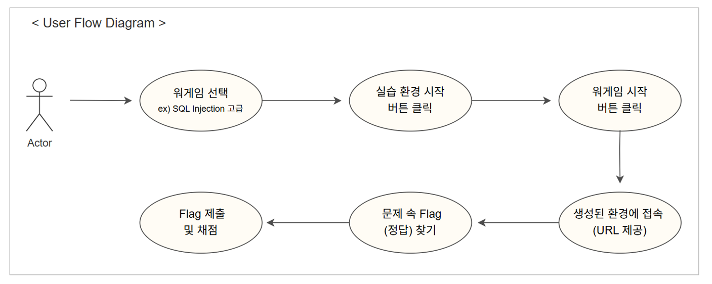
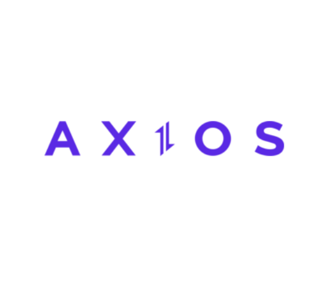
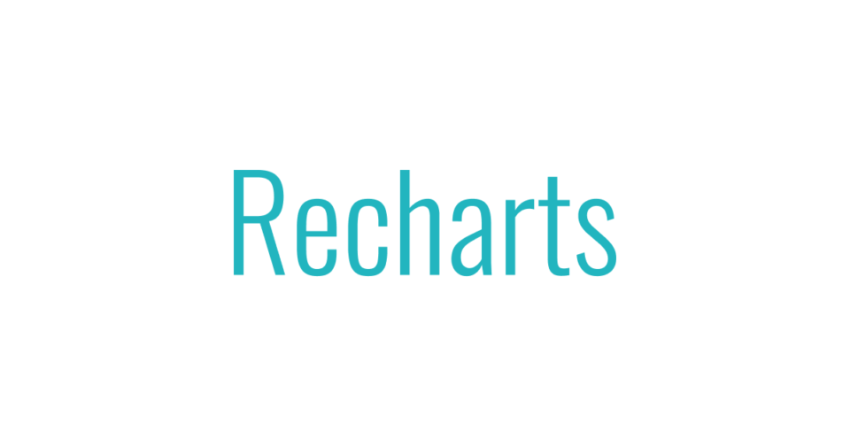

# 우리FISA 4기 최종 프로젝트 - BeeGuardians
<br>

### "배우고 도전하고 성장하세요. 당신의 실력을 수호하는 공간, 가디언즈."

보안 실습 환경 구축에 어려움을 겪는 이들을 위해 (X) <br>
모의해킹 문제와 실시간 환경 배포가 결합된 CTF(Capture The Flag) 플랫폼을 개발했습니다. <br>BeeGuardians는 별도의 설치 없이, 웹에서 바로 실습하고 실력을 시각화하며 성장할 수 있습니다.

<br>

### Team 꿀벌 방범대 소개  
우리FISA 4기 클라우드 엔지니어링 과정 수강생 5명으로 구성된 팀입니다. <br>
웹 애플리케이션 개발과 운영 및 배포(DevOps) 전반을 함께 다루며<br>
약 2개월간 협업을 통해 BeeGuardians 프로젝트를 완성했습니다.

||||||
|:-:|:-:|:-:|:-:|:-:|
|[PM] 한정현<br/>[@letsgojh0810](https://github.com/letsgojh0810)|[PL] 나홍찬<br/>[@HongChan1412](https://github.com/HongChan1412)|김예진<br/>[@yeejkim](https://github.com/yeejkim)|박지혜<br/>[@parkjhhh](https://github.com/parkjhhh)|석혜진<br/>[@HyeJinSeok](https://github.com/HyeJinSeok)|

<br>

### 프로젝트 기간
📆 2025.04.18 ~ 2025.06.10

<br>

### Overview
아래 순서로 BeeGuardians 프로젝트의 주요 내용을 소개합니다 :
1. 프로젝트 개요
2. 기술 스택 및 아키텍처
3. 프론트엔드
4. 백엔드
5. 인프라
6. 주요 기능
7. 트러블 슈팅
8. 회고

<br>

## 1. 프로젝트 개요

### 🎯 문제 인식
- 보안이나 해킹 관련 실습을 해보려면  가상머신(VM) 설정, 각종 도구 설치 등 **복잡한 환경 구성**이 선행되어야 함

- 이 경우 실습 환경이 무겁고 개인별로 **독립된 실습 공간**을 확보하기 어려움

- 여러 사용자가 동일한 환경을 공유할 경우 충돌이나 오류가 발생할 수 있음

- 실습 플랫폼 자체도 부족하거나, 유료 플랫폼이 많아 자유로운 접근이 어려움

### 💡 해결 방안
- 보안이나 해킹 실습 문제를 쉽고 빠르게 수행할 수 있도록
**Kubernetes 기반으로 실습 환경(Pod)** 을 자동 생성하는 구조를 설계함

- 사용자는 버튼 클릭만으로 개인별 **격리된 실습 공간**에 접근 가능하며, 별도의 환경 설정이나 복잡한 설치 없이 실습이 가능함

- 실습 환경은 사용자마다 분리되므로 충돌 없이 안정적인 실습이 가능함

- 전체 과정은 웹에서 이루어지며 접근성과 반복 학습 효율이 높음

<br>

### 🖥️ 모의해킹 실습 환경 - CTF와 Wargame이란?
- **CTF(Capture The Flag)** : <br>
보안 실습에서 널리 사용되는 문제풀이 형식으로, 각 문제를 해결해 특정 문자열인 **“Flag”를 획득**하는 방식으로 진행됨 <br>
문제는 웹 해킹, 포렌식, 리버싱 등 다양한 분야로 구성되며 실전 해킹에 필요한 사고력과 기술을 기를 수 있도록 설계됨

<br>

- **워게임(Wargame)** : <br>
CTF 문제들을 묶어서 제공하는 실습 콘텐츠를 일컫는 말로, 사용자는 각 워게임에서 보안 취약점을 분석하고 공격 기법을 실제처럼 연습할 수 있음 <br>

<br>

  

  <br><br>

  ### 🔸서비스 주요 기능

| 기능 영역         | 설명                                                                 |
|------------------|----------------------------------------------------------------------|
| CTF 문제풀이      | 다양한 난이도의 워게임 선택 및 격리된 실습 환경(Pod) 자동 생성         |
| 채점 시스템       | 사용자 Flag 제출 시 자동 채점 및 정답 여부 실시간 확인                  |
| 랭킹 시스템       | 사용자 점수를 기준으로 순위를 산정하고 랭킹 페이지에서 확인 가능         |
| 사용자 대시보드    | 내 뱃지, 역량 진단표, 타임라인 등 종합 활동 리포트 시각화                 |
| 커리어            | 보안 분야 채용공고 목록 및 상세 정보 확인, 필터링 검색           |
| 커뮤니티 게시판    | 질문/답변 게시글 작성, 댓글 기능, 조회수 확인 등 커뮤니티 기능 제공         |
| 마이페이지        | 내 정보 수정, 내가 쓴 게시글 및 워게임 리뷰 확인                 |
| 관리자 기능       | 워게임/채용공고 등록 및 관리, 사용자 목록 확인 및 삭제           |

  <br><br>

  ### 🔸인프라 주요 기능
```
아샷추
```
  <br><br>

  ## 2. 기술 스택 및 아키텍처

<br>

  ### ৹ 인프라
<table>
  <tr>
      <td align="center" width="80" style="background-color:white;">
      <br/>AWS
    </td>
    <td align="center" width="80" style="background-color:white;">
      <br/>Kubernetes
    </td>
    <td align="center" width="80" style="background-color:white;">
      <br/>ArgoCD
    </td>
    <td align="center" width="80" style="background-color:white;">
      <br/>Jenkins
    </td>
    <td align="center" width="80" style="background-color:white;">
      <br/>Docker
    </td>
    <td align="center" width="80" style="background-color:white;">
      <br/>Terraform
    </td>
    <td align="center" width="80" style="background-color:white;">
      <br/>Ansible
    </td>
  </tr>
  <tr>
    <td align="center" width="80" style="background-color:white;">
      <br/>Prometheus
    </td>
    <td align="center" width="80" style="background-color:white;">
      <br/>Grafana
    </td>
    <td align="center" width="80" style="background-color:white;">
      <br/>Linux
    </td>
    <td align="center" width="80" style="background-color:white;">
      <br/>Git
    </td>
    <td align="center" width="100" style="background-color:white;">
      <br/>Slack
    </td>
    <td align="center" width="80" style="background-color:white;">
      <!-- 빈 셀 또는 추후 확장 가능 -->
    </td>
  </tr>
</table>

<br>

### ৹ 백엔드

<table>
  <tr>
    <td align="center" width="80" style="background-color:white;">
      <br/>Java
    </td>
    <td align="center" width="80" style="background-color:white;">
      <br/>Spring
    </td>
    <td align="center" width="80" style="background-color:white;">
      <br/>Gradle
    </td>
    <td align="center" width="80" style="background-color:white;">
      <br/>IntelliJ
    </td>
        <td align="center" width="80" style="background-color:white;">
      <br/>Hibernate
    </td>
    <td align="center" width="80">
  <br/>Postman
</td>
  </tr>
</table>

<br>

### ৹ 프론트엔드

<table>
  <tr>
      <td align="center" width="80" style="background-color:white;">
      <br/>Vite
    </td>
        <td align="center" width="80" style="background-color:white;">
      <br/>TypeScript
    </td>
    <td align="center" width="80" style="background-color:white;">
      <br/>React
    </td>
    <td align="center" width="80" style="background-color:white;">
      <br/>CSS
    </td>
    <td align="center" width="80" style="background-color:white;">
      <br/>Axios
    </td>
        <td align="center" width="80" style="background-color:white;">
      <br/>Recharts
    </td>
  </tr>
</table>

<br>

### ৹ DB

<table>
  <tr>
    <td align="center" width="80">
      <br/>DBeaver
    </td>
    <td align="center" width="80">
      <br/>PostgresSQL
    </td>
        <td align="center" width="80" style="background-color:white;">
      <br/>Redis
    </td>
